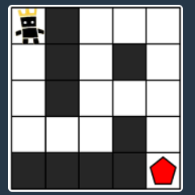

# 5주차

- 주제: DFS

## 공부 정리
- [수연](../../풀이/수연/5주차/Study.md)
- [승현](../../풀이/승현/5주차/Study.md)
- [보영](../../풀이/보영/5주차/readmd.md)

## 001 게임 맵 최단거리

### 문제 링크
- 프로그래머스) https://school.programmers.co.kr/learn/courses/30/lessons/1844 (게임 맵 최단거리 - Level2) 

### 문제
ROR 게임은 두 팀으로 나누어서 진행하며, 상대 팀 진영을 먼저 파괴하면 이기는 게임입니다. 따라서, 각 팀은 상대 팀 진영에 최대한 빨리 도착하는 것이 유리합니다.  
  
지금부터 당신은 한 팀의 팀원이 되어 게임을 진행하려고 합니다. 다음은 5 x 5 크기의 맵에, 당신의 캐릭터가 (행: 1, 열: 1) 위치에 있고, 상대 팀 진영은 (행: 5, 열: 5) 위치에 있는 경우의 예시입니다.  
  

  
  
위 그림에서 검은색 부분은 벽으로 막혀있어 갈 수 없는 길이며, 흰색 부분은 갈 수 있는 길입니다. 캐릭터가 움직일 때는 동, 서, 남, 북 방향으로 한 칸씩 이동하며, 게임 맵을 벗어난 길은 갈 수 없습니다.  
아래 예시는 캐릭터가 상대 팀 진영으로 가는 두 가지 방법을 나타내고 있습니다.  
  
첫 번째 방법은 11개의 칸을 지나서 상대 팀 진영에 도착했습니다.  

  
두 번째 방법은 15개의 칸을 지나서 상대팀 진영에 도착했습니다.  
  
  
위 예시에서는 첫 번째 방법보다 더 빠르게 상대팀 진영에 도착하는 방법은 없으므로, 이 방법이 상대 팀 진영으로 가는 가장 빠른 방법입니다.  
  
만약, 상대 팀이 자신의 팀 진영 주위에 벽을 세워두었다면 상대 팀 진영에 도착하지 못할 수도 있습니다. 예를 들어, 다음과 같은 경우에 당신의 캐릭터는 상대 팀 진영에 도착할 수 없습니다.  
  

  
게임 맵의 상태 maps가 매개변수로 주어질 때, 캐릭터가 상대 팀 진영에 도착하기 위해서 지나가야 하는 칸의 개수의 최솟값을 return 하도록 solution 함수를 완성해주세요.   
단, 상대 팀 진영에 도착할 수 없을 때는 -1을 return 해주세요.  
  
*제한사항*       
maps는 n x m 크기의 게임 맵의 상태가 들어있는 2차원 배열로, n과 m은 각각 1 이상 100 이하의 자연수입니다.  
n과 m은 서로 같을 수도, 다를 수도 있지만, n과 m이 모두 1인 경우는 입력으로 주어지지 않습니다.  
maps는 0과 1로만 이루어져 있으며, 0은 벽이 있는 자리, 1은 벽이 없는 자리를 나타냅니다.   
처음에 캐릭터는 게임 맵의 좌측 상단인 (1, 1) 위치에 있으며, 상대방 진영은 게임 맵의 우측 하단인 (n, m) 위치에 있습니다.  
  
### 풀이
  - [보영](../../풀이/보영/5주차/ex01.java)
  - [수연](../../풀이/수연/5주차/ex01.java)
  - [승현](../../풀이/승현/5주차/Ex01.java)
  - [인호](../../풀이/인호/5주차/P001.java)
  - [현화](../../풀이/현화/5주차/Main001.java)

## 002 ABCDE

### 문제 링크
- 백준) https://www.acmicpc.net/problem/13023 (ABCDE - 골드5)
- 책) 'Do it! 알고리즘 코딩테스트 - 자바편' p

### 문제
BOJ 알고리즘 캠프에는 총 N명이 참가하고 있다. 사람들은 0번부터 N-1번으로 번호가 매겨져 있고, 일부 사람들은 친구이다.  
  
오늘은 다음과 같은 친구 관계를 가진 사람 A, B, C, D, E가 존재하는지 구해보려고 한다.  
  
A는 B와 친구다.  
B는 C와 친구다.  
C는 D와 친구다.  
D는 E와 친구다.  
위와 같은 친구 관계가 존재하는지 안하는지 구하는 프로그램을 작성하시오.   
   
### 풀이
  - [보영](../../풀이/보영/5주차/Main2.java)
  - [수연](../../풀이/수연/5주차/ex02.java)
  - [승현](../../풀이/승현/5주차/Ex02.java)
  - [인호](../../풀이/인호/5주차/P002.java)
  - [현화](../../풀이/현화/5주차/Main002.java)

## 003 바이러스

### 문제 링크
- 백준) https://www.acmicpc.net/problem/2606 (바이러스 - 실버3)

### 문제
신종 바이러스인 웜 바이러스는 네트워크를 통해 전파된다. 한 컴퓨터가 웜 바이러스에 걸리면 그 컴퓨터와 네트워크 상에서 연결되어 있는 모든 컴퓨터는 웜 바이러스에 걸리게 된다.

예를 들어 7대의 컴퓨터가 <그림 1>과 같이 네트워크 상에서 연결되어 있다고 하자. 
1번 컴퓨터가 웜 바이러스에 걸리면 웜 바이러스는 2번과 5번 컴퓨터를 거쳐 3번과 6번 컴퓨터까지 전파되어 2, 3, 5, 6 네 대의 컴퓨터는 웜 바이러스에 걸리게 된다. 
하지만 4번과 7번 컴퓨터는 1번 컴퓨터와 네트워크상에서 연결되어 있지 않기 때문에 영향을 받지 않는다.  
  
    

어느 날 1번 컴퓨터가 웜 바이러스에 걸렸다.   
컴퓨터의 수와 네트워크 상에서 서로 연결되어 있는 정보가 주어질 때, 1번 컴퓨터를 통해 웜 바이러스에 걸리게 되는 컴퓨터의 수를 출력하는 프로그램을 작성하시오.  
  
### 풀이
  - [보영](../../풀이/보영/5주차/ex03.java)
  - [수연](../../풀이/수연/5주차/ex03.java)
  - [승현](../../풀이/승현/5주차/Ex03.java)
  - [인호](../../풀이/인호/5주차/P003.java)
  - [현화](../../풀이/현화/5주차/Main003.java)
