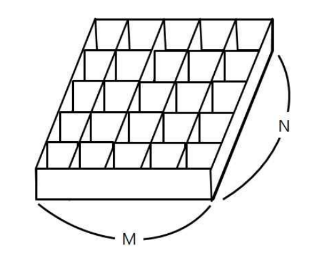

# 9주차

- 주제: 그래프

## 공부 정리
- [수연](../../풀이/수연/9주차/README.md)
- [승현](../../풀이/승현/9주차/README.md)

## 047 효율적으로 해킹하기

### 문제 링크
- 백준) https://www.acmicpc.net/problem/1325 (효율적인 해킹 - 실버1)  
- 책) 'Do it! 알고리즘 코딩테스트 - 자바편' p.265  

### 문제
해커 김지민은 잘 알려진 어느 회사를 해킹하려고 한다. 이 회사는 N개의 컴퓨터로 이루어져 있다. 김지민은 귀찮기 때문에, 한 번의 해킹으로 여러 개의 컴퓨터를 해킹 할 수 있는 컴퓨터를 해킹하려고 한다.   
  
이 회사의 컴퓨터는 신뢰하는 관계와, 신뢰하지 않는 관계로 이루어져 있는데, A가 B를 신뢰하는 경우에는 B를 해킹하면, A도 해킹할 수 있다는 소리다.  
  
이 회사의 컴퓨터의 신뢰하는 관계가 주어졌을 때, 한 번에 가장 많은 컴퓨터를 해킹할 수 있는 컴퓨터의 번호를 출력하는 프로그램을 작성하시오.  
   
### 풀이
  - [보영](../../풀이/보영/9주차/ex47.java)
  - [수연](../../풀이/수연/9주차/ex47.java)
  - [승현](../../풀이/승현/9주차/Ex47.java)
  - [인호](../../풀이/인호/9주차/P047.java)
  - [현화](../../풀이/현화/9주차/Main047.java)
  - [채영](../../풀이/채영/9주차/ex47.java)

## 001 토마토

### 문제 링크
- 백준) https://www.acmicpc.net/problem/7576 (토마토 - 골드5)    

### 문제  
철수의 토마토 농장에서는 토마토를 보관하는 큰 창고를 가지고 있다. 토마토는 아래의 그림과 같이 격자 모양 상자의 칸에 하나씩 넣어서 창고에 보관한다.   

  
창고에 보관되는 토마토들 중에는 잘 익은 것도 있지만, 아직 익지 않은 토마토들도 있을 수 있다. 보관 후 하루가 지나면, 익은 토마토들의 인접한 곳에 있는 익지 않은 토마토들은 익은 토마토의 영향을 받아 익게 된다.   
하나의 토마토의 인접한 곳은 왼쪽, 오른쪽, 앞, 뒤 네 방향에 있는 토마토를 의미한다. 대각선 방향에 있는 토마토들에게는 영향을 주지 못하며, 토마토가 혼자 저절로 익는 경우는 없다고 가정한다.   
철수는 창고에 보관된 토마토들이 며칠이 지나면 다 익게 되는지, 그 최소 일수를 알고 싶어 한다.  
  
토마토를 창고에 보관하는 격자모양의 상자들의 크기와 익은 토마토들과 익지 않은 토마토들의 정보가 주어졌을 때, 며칠이 지나면 토마토들이 모두 익는지, 그 최소 일수를 구하는 프로그램을 작성하라.   
단, 상자의 일부 칸에는 토마토가 들어있지 않을 수도 있다.  
  

  
### 풀이
  - [보영](../../풀이/보영/9주차/ex01.java)
  - [수연](../../풀이/수연/9주차/ex01.java)
  - [승현](../../풀이/승현/9주차/Ex01.java)
  - [인호](../../풀이/인호/9주차/P001.java)
  - [현화](../../풀이/현화/9주차/Main001.java)
  - [채영](../../풀이/채영/9주차/ex01.java)

## 002 연구소

### 문제 링크
- 백준)  https://www.acmicpc.net/problem/14502 (연구소 - 골드4)
  
  

### 문제
인체에 치명적인 바이러스를 연구하던 연구소에서 바이러스가 유출되었다. 다행히 바이러스는 아직 퍼지지 않았고, 바이러스의 확산을 막기 위해서 연구소에 벽을 세우려고 한다.  
  
연구소는 크기가 N×M인 직사각형으로 나타낼 수 있으며, 직사각형은 1×1 크기의 정사각형으로 나누어져 있다. 연구소는 빈 칸, 벽으로 이루어져 있으며, 벽은 칸 하나를 가득 차지한다.     
   
일부 칸은 바이러스가 존재하며, 이 바이러스는 상하좌우로 인접한 빈 칸으로 모두 퍼져나갈 수 있다. 새로 세울 수 있는 벽의 개수는 3개이며, 꼭 3개를 세워야 한다.    
  
예를 들어, 아래와 같이 연구소가 생긴 경우를 살펴보자.
      
  
### 풀이
  - [보영](../../풀이/보영/9주차/ex02.java)
  - [수연](../../풀이/수연/9주차/ex02.java)
  - [승현](../../풀이/승현/9주차/Ex02.java)
  - [인호](../../풀이/인호/9주차/P002.java)
  - [현화](../../풀이/현화/9주차/Main002.java)
  - [채영](../../풀이/채영/9주차/ex02.java)

## 복습) 수 묶기

### 문제 링크
- 백준) https://www.acmicpc.net/problem/1744 (수 묶기 - 골드4)
- 그리디 복습 문제  
  

### 문제
길이가 N인 수열이 주어졌을 때, 그 수열의 합을 구하려고 한다. 하지만, 그냥 그 수열의 합을 모두 더해서 구하는 것이 아니라, 수열의 두 수를 묶으려고 한다. 어떤 수를 묶으려고 할 때, 위치에 상관없이 묶을 수 있다.   
하지만, 같은 위치에 있는 수(자기 자신)를 묶는 것은 불가능하다. 그리고 어떤 수를 묶게 되면, 수열의 합을 구할 때 묶은 수는 서로 곱한 후에 더한다.  
  
예를 들면, 어떤 수열이 {0, 1, 2, 4, 3, 5}일 때, 그냥 이 수열의 합을 구하면 0+1+2+4+3+5 = 15이다. 하지만, 2와 3을 묶고, 4와 5를 묶게 되면, 0+1+(2*3)+(4*5) = 27이 되어 최대가 된다.  
  
수열의 모든 수는 단 한번만 묶거나, 아니면 묶지 않아야한다.  
   
수열이 주어졌을 때, 수열의 각 수를 적절히 묶었을 때, 그 합이 최대가 되게 하는 프로그램을 작성하시오.    
    
  
### 풀이
  - [보영](../../풀이/보영/9주차/review.java)
  - [수연](../../풀이/수연/9주차/review.java)
  - [승현](../../풀이/승현/9주차/review.java)
  - [인호](../../풀이/인호/9주차/review.java)
  - [현화](../../풀이/현화/9주차/review.java)
  - [채영](../../풀이/채영/9주차/review.java)

