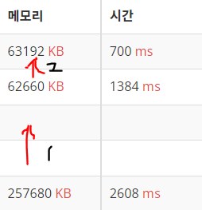

## 시간 줄이기 !



### 1. BufferedReader

```
  BufferedReader br = new BufferedReader(new InputStreamReader(System.in));
  StringTokenizer st = new StringTokenizer(br.readLine());
  int n = Integer.parseInt(st.nextToken());
```
[BufferedReader VS Scanner](https://lasbe.tistory.com/48)


### 2. StringBuilder
```
  StringBuilder sb = new StringBuilder(); //객체 생성
  sb.append(res + "\n");    //필요한 곳에서 결과 저장
          
  System.out.println(sb.toString());  //한번에 출력
  
```
[StringBuilder란](https://hardlearner.tistory.com/288)
